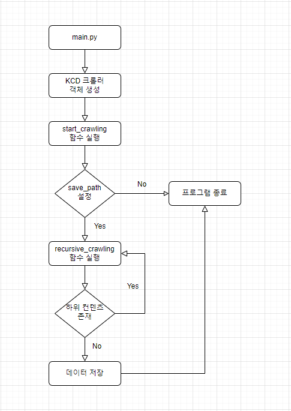

[//]: <> (This is a comment)
[//]: <> (Titles)
# 업무에 필요한 크롤러를 만드는 프로젝트
## 1. 환경 구축
### 1.1 Pycharm 설치
**https://www.jetbrains.com/ko-kr/pycharm/download/#section=windows**
######
**※ 위 경로에서 Community 버전을 다운 받아 설치**
### 1.2 Anaconda 설치
**https://www.anaconda.com/**
######
**※ 위 경로에서 window 버전을 다운 받아 설치**
### 1.3 Anaconda 를 사용해 가상 환경 구축
```commandline
[가상환경 생성]
conda create -n [가상환경이름] python=3.8

[가상환경 시작/종료]
conda activate [가상환경이름]
conda deactivate [가상환경이름]
```
### 1.4 Anaconda 기본 명령어
```commandline
[설치된 패키지 목록 보기]
conda list

[단일 패키지 설치]
conda install pandas

[2개 이상의 패키지 설치]
conda install pandas numpy tensorflow

[단일 패키지 업데이트]
conda update pandas

[설치된 패키지 모두 업데이트]
conda update --all

[패키지 제거]
conda remove pandas

[설치된 패키지 검색]
conda search '*pandas'
```

## 2. 필요 라이브러리
### 2.1 undetected-chromedriver 
#### (1) 설치
```
pip install undetected-chromedriver
```
#### (2) 사용법
```commandline
import undetected-chromedriver

driver = uc.Chrome()
driver.get("주소")
```
### 2.2 unpackable
#### (1) 설치
```commandline
pip install unpackable
```
#### (2) 사용법
```commandline
from dataclasses import dataclass
from unpackable import Unpackable

@dataclass
class User(Unpackable):
  id: int
  email: str

user = User(1, 'example@example.com')
id, email = user  # destructure
```
```commandline
from unpackable import unpack

@dataclass
class User:
  id: int
  email: str

user = User(1, 'example@example.com')
id, email = unpack(user)  # destructure
```
### 2.3 openpyxl
#### (1) 설치
```commandline
pip install openpyxl
```
#### (2) 사용법
##### ■ 엑셀에 데이터 쓰기
```commandline
from openpyxl import Workbook

# 엑셀파일 쓰기
write_wb = Workbook()

# 이름이 있는 시트를 생성
write_ws = write_wb.create_sheet('생성시트')

# Sheet1에다 입력
write_ws = write_wb.active
write_ws['A1'] = '숫자'

#행 단위로 추가
write_ws.append([1,2,3])

#셀 단위로 추가
write_ws.cell(5, 5, '5행5열')
write_wb.save("C:/Users/Administrator/Desktop/기준/프로그래밍/과제대행/주식데이터크롤링/숫자.xlsx")
```
##### ■ 엑셀 데이터 읽기
```commandline
from openpyxl import load_workbook

# data_only=True로 해줘야 수식이 아닌 값으로 받아온다. 
load_wb = load_workbook("C:/Users/Administrator/Desktop/기준/프로그래밍/과제대행/주식데이터크롤링/output.xlsx", data_only=True)
# 시트 이름으로 불러오기 
load_ws = load_wb['Sheet1']

# 셀 주소로 값 출력
print(load_ws['B2'].value)

# 셀 좌표로 값 출력
print(load_ws.cell(3, 2).value)

# 지정한 셀의 값 출력
get_cells = load_ws['B3' : 'B6']
for row in get_cells:
    for cell in row:
        print(cell.value)

# 모든 행 단위로 출력
for row in load_ws.rows:
    print(row)

# 모든 열 단위로 출력
for column in load_ws.columns:
    print(column)

# 모든 행과 열 출력
all_values = []
for row in load_ws.rows:
    row_value = []
    for cell in row:
        row_value.append(cell.value)
    all_values.append(row_value)
print(all_values)

load_ws.cell(3, 3, 51470)
load_ws.cell(4, 3, 21470)
load_ws.cell(5, 3, 1470)
load_ws.cell(6, 3, 6470)
load_wb.save("C:/Users/Administrator/Desktop/기준/프로그래밍/과제대행/주식데이터크롤링/output.xlsx")
```
## 3. 도식도
### 3.1 KCD 크롤러

